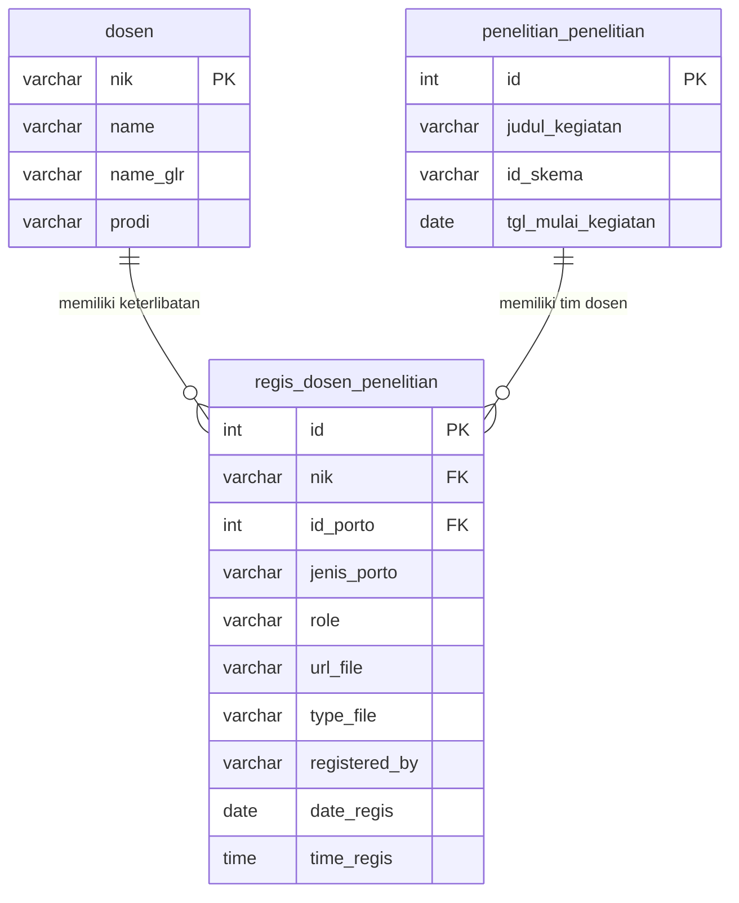
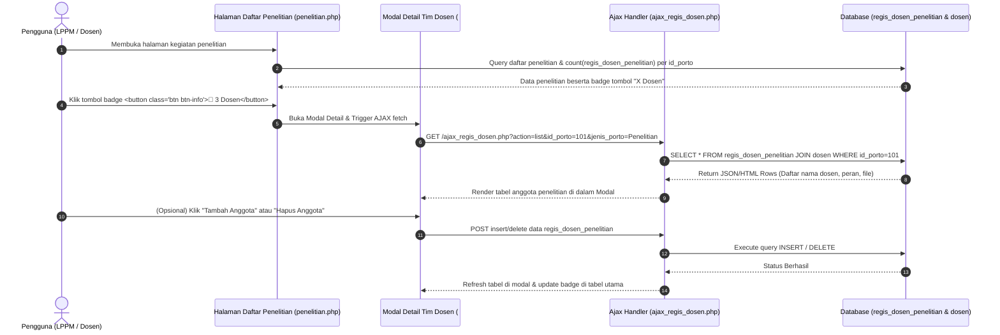

# Desain Arsitektur & UI/UX: Perombakan Fitur Penelitian (`regis_dosen_penelitian`)

> [!IMPORTANT]
> **Tujuan Utama**: Mengubah arsitektur relasi data dari yang sebelumnya bersifat tunggal (*1-to-1* / satu dosen per kegiatan) menjadi relasi *many-to-many* menggunakan tabel pivot khusus **`regis_dosen_penelitian`**. Fitur ini memungkinkan satu kegiatan penelitian memiliki banyak dosen yang tergabung (Ketua, Anggota 1, Anggota 2, dst.), lengkap dengan pencatatan file lampiran, waktu registrasi, dan antarmuka interaktif.

---

## 1. Latar Belakang & Masalah Saat Ini

Pada arsitektur sistem saat ini di modul [penelitian.php](file:///D:/WEB%20APP/simlitabmas/module/content/penelitian/lppm/penelitian.php) dan handler insert [insert/penelitian.php](file:///D:/WEB%20APP/simlitabmas/module/content/insert/penelitian.php):
- Tabel `penelitian_penelitian` hanya menyimpan **satu** kolom `nip_dosen` dan **satu** `id_peran`.
- Hal ini menyebabkan sebuah kegiatan penelitian yang dikerjakan secara tim (misalnya 1 Ketua dan 2 Anggota Dosen) tidak dapat mencatat keterlibatan dosen anggota secara terstruktur dan terintegrasi dalam satu ID Penelitian.
- Tampilan tabel utama hanya menampilkan satu nama dosen penanggung jawab / ketua.

### Solusi Arsitektur Baru
Dengan memperkenalkan tabel pivot (relasi/junction) **`regis_dosen_penelitian`**, sistem dapat:
1. Menghubungkan banyak dosen (`dosen.nik`) ke satu ID Penelitian (`id_porto`).
2. Menyimpan atribut spesifik untuk tiap dosen yang terlibat, seperti peran (`role`), file SK/Tugas khusus dosen tersebut (`url_file`, `type_file`), serta jejak audit (`registered_by`, `date_regis`, `time_regis`).
3. Membatasi ruang lingkup tabel ini secara rapi khusus untuk portofolio penelitian, sehingga struktur database tetap bersih dan mudah dikelola.

---

## 2. Spesifikasi Struktur Tabel Pivot (`regis_dosen_penelitian`)

Tabel **`regis_dosen_penelitian`** akan berfungsi sebagai pusat registrasi dosen pada setiap portofolio penelitian.

### SQL DDL (Data Definition Language)
```sql
CREATE TABLE `regis_dosen_penelitian` (
  `id` int(11) NOT NULL AUTO_INCREMENT,
  `nik` varchar(30) NOT NULL COMMENT 'NIK Dosen yang tergabung (Foreign Key ke tabel dosen)',
  `id_porto` int(11) NOT NULL COMMENT 'ID dari tabel penelitian_penelitian',
  `jenis_porto` varchar(50) NOT NULL DEFAULT 'Penelitian' COMMENT 'Jenis Portofolio (default: Penelitian)',
  `role` varchar(50) NOT NULL COMMENT 'Peran dalam kegiatan: Ketua, Anggota 1, Anggota 2, Penulis Pertama, Penulis Korespondensi, dll.',
  `url_file` varchar(255) DEFAULT NULL COMMENT 'URL/Path file lampiran khusus dosen (SK Tugas, Surat Pernyataan, dll.)',
  `type_file` varchar(50) DEFAULT NULL COMMENT 'Jenis dokumen file (misal: SK Tugas, Sertifikat, Kontrak)',
  `registered_by` varchar(30) NOT NULL COMMENT 'Username/NIK/NIP admin atau dosen yang mendaftarkan data',
  `date_regis` date NOT NULL COMMENT 'Tanggal pendaftaran (YYYY-MM-DD)',
  `time_regis` time NOT NULL COMMENT 'Waktu pendaftaran (HH:MM:SS)',
  PRIMARY KEY (`id`),
  KEY `idx_nik` (`nik`),
  KEY `idx_porto` (`id_porto`, `jenis_porto`),
  KEY `idx_role` (`role`)
) ENGINE=InnoDB DEFAULT CHARSET=utf8mb4 COMMENT='Tabel Pivot Relasi Dosen dan Kegiatan Penelitian';
```

### Kamus Data (Data Dictionary)
| Nama Kolom | Tipe Data | Keterangan / Aturan Validasi |
| :--- | :--- | :--- |
| **`id`** | `INT(11)` | Primary Key, Auto Increment. |
| **`nik`** | `VARCHAR(30)` | Wajib diisi. Merujuk ke kolom `nik` pada tabel `dosen`. |
| **`id_porto`** | `INT(11)` | Wajib diisi. Merujuk ke `id` pada tabel `penelitian_penelitian`. |
| **`jenis_porto`** | `VARCHAR(50)` | Default `'Penelitian'`. |
| **`role`** | `VARCHAR(50)` | Peran dosen dalam tim (contoh: `'Ketua'`, `'Anggota'`, `'Penulis Korespondensi'`). |
| **`url_file`** | `VARCHAR(255)` | Path file lampiran yang diunggah (contoh: `dist/upload/regis_dosen_penelitian/file_101.pdf`). |
| **`type_file`** | `VARCHAR(50)` | Kategori dokumen yang diunggah (contoh: `'SK Tugas'`, `'Surat Tugas'`). |
| **`registered_by`** | `VARCHAR(30)` | ID Pengguna (`$_SESSION['ses_user']`) yang melakukan insert/update. |
| **`date_regis`** | `DATE` | Tanggal registrasi, diisi otomatis dengan `date('Y-m-d')`. |
| **`time_regis`** | `TIME` | Waktu registrasi, diisi otomatis dengan `date('H:i:s')`. |

---

## 3. Visualisasi Arsitektur & Relasi (ERD & Flowchart)

### Entity-Relationship Diagram (ERD)


### Alur Interaksi UI (UI/UX Interaction Flow)


---

## 4. Desain UI/UX & Interaksi Tampilan

### A. Perubahan pada Tabel Utama Penelitian ([penelitian.php](file:///D:/WEB%20APP/simlitabmas/module/content/penelitian/lppm/penelitian.php))
Pada tabel `#tabel-penelitian`, kolom **Nama Dosen** dan **Peran** yang sebelumnya bersifat statis (hanya menampilkan satu orang) akan dimodifikasi:
1. Kolom **Tim Peneliti / Dosen Tergabung**: Menampilkan tombol badge interaktif berisikan jumlah dosen yang teregistrasi di kegiatan tersebut.
2. Contoh tampilan visual kolom pada tabel:
   - Jika ada 3 dosen tergabung:  
     `<button class="btn btn-sm btn-info btn-detail-dosen shadow-sm" data-id="101" data-judul="Analisis AI dalam Manajemen LPPM"><i class="fas fa-users mr-1"></i> 3 Dosen</button>`
   - Jika belum ada data di `regis_dosen_penelitian` (karena data lama):  
     `<button class="btn btn-sm btn-warning btn-detail-dosen shadow-sm" data-id="102" data-judul="..."><i class="fas fa-user-plus mr-1"></i> 1 Dosen (Migrasi)</button>`

> [!TIP]
> **Elemen Desain Premium**: Gunakan *badge gradient* (misalnya kombinasi biru malam `btn-info` dengan efek hover transisi halus dan *box-shadow*) agar tampilan terlihat modern, responsif, dan mengundang interaksi klik dari pengguna.

### B. Desain Modal Interaktif Detail Dosen (`#modalDetailDosen`)
Ketika tombol **"X Dosen"** diklik, sebuah modal elegan akan muncul tanpa me-reload halaman utama:

```html
<!-- Contoh Struktur UX Modal Detail Dosen -->
<div class="modal fade" id="modalDetailDosen" tabindex="-1" role="dialog">
  <div class="modal-dialog modal-lg modal-dialog-centered" role="document">
    <div class="modal-content border-0 shadow-lg">
      <div class="modal-header bg-gradient-info text-white">
        <h5 class="modal-title"><i class="fas fa-users mr-2"></i> Tim Dosen Peneliti</h5>
        <button type="button" class="close text-white" data-dismiss="modal">&times;</button>
      </div>
      <div class="modal-body p-4">
        <div class="alert alert-light border-left-info mb-3">
          <strong>Judul Kegiatan:</strong> <span id="modal-judul-penelitian">-</span>
        </div>
        
        <!-- Tombol Tambah Anggota (Muncul untuk admin LPPM / Ketua Peneliti) -->
        <div class="mb-3 text-right">
          <button class="btn btn-sm btn-success shadow-sm" id="btnTambahAnggota">
            <i class="fas fa-user-plus mr-1"></i> Tambah Anggota Dosen
          </button>
        </div>

        <!-- Tabel Daftar Dosen Tergabung (regis_dosen_penelitian) -->
        <div class="table-responsive">
          <table class="table table-bordered table-hover text-nowrap w-100" id="tabel-regis-dosen">
            <thead class="bg-light">
              <tr>
                <th>No</th>
                <th>NIK</th>
                <th>Nama Dosen & Gelar</th>
                <th>Peran</th>
                <th>Jenis File</th>
                <th>File Lampiran</th>
                <th>Tanggal Regis</th>
                <th class="text-center">Aksi</th>
              </tr>
            </thead>
            <tbody id="tbody-regis-dosen">
              <!-- Diisi secara dinamis melalui AJAX -->
            </tbody>
          </table>
        </div>
      </div>
    </div>
  </div>
</div>
```

---

## 5. Rencana Migrasi & Tahapan Implementasi

Untuk menjaga *backward compatibility* dengan data penelitian yang sudah ada di database saat ini, implementasi akan dibagi ke dalam **5 Tahap (Phases)**:

### Tahap 1: Eksekusi DDL & Pembuatan Tabel Database
- Membuat tabel `regis_dosen_penelitian` di MySQL database sesuai spesifikasi DDL pada Poin 2.

### Tahap 2: Skrip Migrasi Data Lama (*Auto-Seed*)
- Membuat skrip migrasi sekali jalan (misalnya di `module/content/penelitian/lppm/migrate_regis.php`) yang mengambil semua data eksisting dari `penelitian_penelitian` (`id`, `nip_dosen`, `id_peran`).
- Memasukkan data tersebut ke tabel `regis_dosen_penelitian` dengan `jenis_porto = 'Penelitian'`, mapping `id_peran` ke deskripsi peran (atau `'Ketua'`), serta mengisi `date_regis` dan `time_regis` sesuai data pembuatan awal.

### Tahap 3: Pembuatan Backend Handler & AJAX API
- Membuat file endpoint AJAX, contoh: `module/content/penelitian/lppm/ajax_regis_dosen.php`.
- Menangani 4 operasi utama:
  1. `list`: Mengambil daftar anggota dosen dari `regis_dosen_penelitian` berdasarkan `id_porto`.
  2. `add`: Menambahkan dosen baru ke `regis_dosen_penelitian` (opsional disertai upload file SK/Tugas).
  3. `update`: Mengubah peran atau file lampiran anggota dosen.
  4. `delete`: Menghapus anggota dosen dari kegiatan penelitian.

### Tahap 4: Refactoring Tampilan Utama ([penelitian.php](file:///D:/WEB%20APP/simlitabmas/module/content/penelitian/lppm/penelitian.php))
- Memodifikasi query utama `SELECT` agar menghitung jumlah anggota dosen dari `regis_dosen_penelitian` (menggunakan *subquery* atau *LEFT JOIN* dengan `GROUP BY`).
- Mengganti teks statis nama dosen menjadi tombol badge interaktif yang memicu pembukaan `#modalDetailDosen`.
- Menambahkan skrip JavaScript/jQuery untuk menangani klik tombol, memuat data AJAX, dan menampilkan modal dengan animasi halus.

### Tahap 5: Integrasi pada Form Tambah & Edit ([tambah.php](file:///D:/WEB%20APP/simlitabmas/module/content/penelitian/lppm/form/penelitian/tambah.php) & [edit.php](file:///D:/WEB%20APP/simlitabmas/module/content/penelitian/lppm/form/penelitian/edit.php))
- **Pada Form Tambah**: Dosen pertama yang dipilih pada *dropdown* otomatis dicatat ke dalam `regis_dosen_penelitian` sebagai **Ketua** setelah kegiatan penelitian berhasil disimpan. Selain itu, disediakan opsi input dinamis (*add more rows*) untuk langsung menambahkan dosen anggota sekaligus.
- **Pada Form Edit**: Menambahkan *tab* atau bagian khusus **"Manajemen Anggota Dosen"** agar pengguna dapat menambah, mengubah, atau menghapus anggota peneliti dengan mudah.

---

## 6. Contoh Mockup Data Tabel `regis_dosen_penelitian`

| id | nik | id_porto | jenis_porto | role | url_file | type_file | registered_by | date_regis | time_regis |
| :-: | :-: | :-: | :--- | :--- | :--- | :--- | :--- | :-: | :-: |
| 1 | 1980010101 | 101 | Penelitian | Ketua | `dist/upload/regis_dosen_penelitian/sk_101_ketua.pdf` | SK Tugas | lppm_admin | 2026-07-02 | 09:30:00 |
| 2 | 1985020202 | 101 | Penelitian | Anggota 1 | `dist/upload/regis_dosen_penelitian/spt_101_ang1.pdf` | Surat Pernyataan | lppm_admin | 2026-07-02 | 09:31:15 |
| 3 | 1990030303 | 101 | Penelitian | Anggota 2 | `dist/upload/regis_dosen_penelitian/spt_101_ang2.pdf` | Surat Pernyataan | lppm_admin | 2026-07-02 | 09:32:10 |
| 4 | 1975050505 | 102 | Penelitian | Ketua | `dist/upload/regis_dosen_penelitian/sk_102_ketua.pdf` | SK Tugas | dosen_user | 2026-07-02 | 10:15:00 |

---

> [!NOTE]
> **Langkah Selanjutnya (Next Action)**:
> Dokumen desain ini telah siap untuk direview. Jika Anda sudah menyetujui struktur tabel `regis_dosen_penelitian` dan alur UI/UX di atas, silakan konfirmasi untuk melanjutkan ke eksekusi **Tahap 1 (Pembuatan Tabel Database & Skrip Migrasi)** serta modifikasi kode PHP dan UI secara bertahap.
